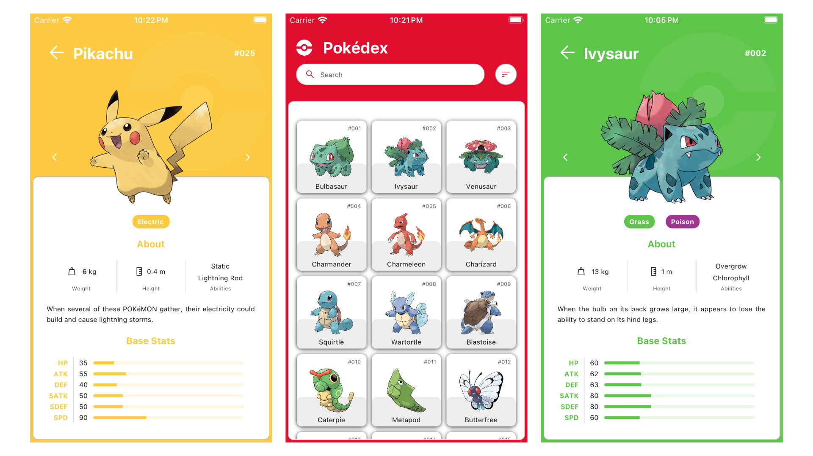

# Pokédex App

A pokémon encyclopedia app for iOS and Android powered by React Native.


## Features

- Atomic Design
- Design System
- Custom Fonts
- Environment Variables
- Loading Skeleton Placeholder
- Performant Infinite List
- React Navigation
- React Query
- REST API Client
- Styled Components
- SVG Icons
- TypeScript


## Resources

- Design System File - [Pokédex Prototype Figma](https://www.figma.com/community/file/979132880663340794) by [Ricardo Schiniegoski](https://www.figma.com/@ricardohs)
- REST API - [Pokémon API](https://pokeapi.co/) by [PokéAPI](https://github.com/PokeAPI)


## Environment Variables

To run this project, you will need to add the following environment variables to your .env file

`BASE_URL` = https://pokeapi.co/api/v2

`IMAGE_URL` = https://raw.githubusercontent.com/PokeAPI/sprites/master/sprites/pokemon/other/official-artwork


## Run Locally

Clone the project

```bash
  git clone https://github.com/alexup19/PokedexApp.git
```

Go to the project directory

```bash
  cd PokedexApp
```

Install dependencies

```bash
  npm install
  cd ios
  pod install
```

Start Metro

```bash
  npm start
```

Start the App

```bash
  npm run ios
  npm run android
```


## Roadmap

- App Icon
- Offline Mode
- Splash Screen

Considering that the REST API from PokéAPI does not support any kind of search or filter parameters, the following features will be added together in the future:

- GraphQL Client - Consuming [PokéAPI GraphQL](https://pokeapi.co/docs/graphql) 
- Filter Pokémon - Using PokéAPI GraphQL Client
- Search Pokémon - Using PokéAPI GraphQL Client
