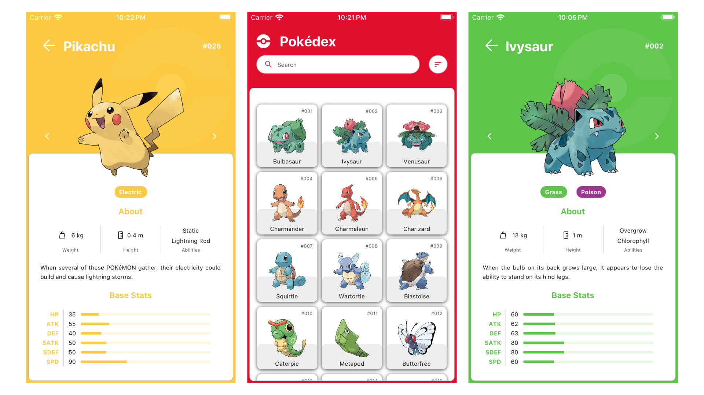

# Pokédex App

A pokémon encyclopedia app for iOS and Android powered by React Native.


## Features

- Atomic Design
- Design System
- Performant Infinite List
- React Config
- React Navigation
- React Query
- Styled Components
- SVG Icons
- TypeScript


## Resources

- API - [Pokémon API](https://pokeapi.co/) by [PokéAPI](https://github.com/PokeAPI)
- Design System - [Pokédex Figma App](https://www.figma.com/community/file/979132880663340794) by [Ricardo Schiniegoski](https://www.figma.com/@ricardohs)


## Environment Variables

To run this project, you will need to add the following environment variables to your .env file

`BASE_URL` = https://pokeapi.co/api/v2

`IMAGE_URL` = https://raw.githubusercontent.com/PokeAPI/sprites/master/sprites/pokemon/other/official-artwork


## Run Locally

Clone the project

```bash
  git clone https://github.com/alexup19/PokedexApp.git
```

Go to the project directory

```bash
  cd PokedexApp
```

Install dependencies

```bash
  npm install
  cd ios
  pod install
```

Start the App

```bash
  npx react-native run-ios
  npx react-native run-android
```

